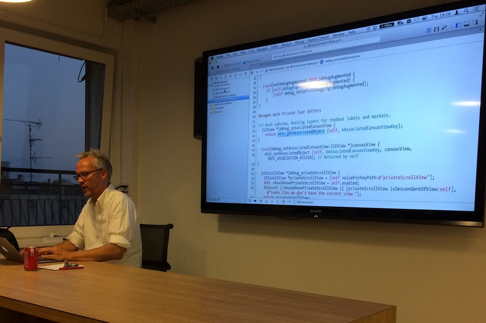
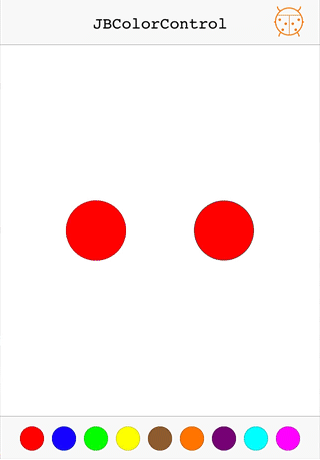

# JBColorControl

A fully accessible custom `UIControl`, as demoed at the [September 11, 2014, CopenhagenCocoa event](https://www.meetup.com/CopenhagenCocoa/events/197382132/):

The code illustrates what it took to be a fairly good `UIControl` at the time (probably not too far from what it takes today), but was written with the demo in mind. It is therefore not production quality, but may serve as inspiration to some.

This is how it looks in action:

## Key Points

The tags mark various key points in the demo (deltas):

1. A basic starting point: [`1-start`](https://github.com/osteslag/JBColorControl/tree/1-start)
2. Add infinite scrolling: [`2-infinite-scrolling`](https://github.com/osteslag/JBColorControl/compare/1-start...2-infinite-scrolling)
3. Add Debug button and category: [`3-debug`](https://github.com/osteslag/JBColorControl/compare/2-infinite-scrolling...3-debug)
4. Add support for target/action pattern: [`4-target-action`](https://github.com/osteslag/JBColorControl/compare/3-debug...4-target-action)
5. Support KVO: [`5-kvo`](https://github.com/osteslag/JBColorControl/compare/4-target-action...5-kvo)
6. Add Accessibility support: [`6-accessibility`](https://github.com/osteslag/JBColorControl/compare/5-kvo...6-accessibility)
7. Add custom localized Accessibility properties: [`7-accessibility-values`](https://github.com/osteslag/JBColorControl/compare/6-accessibility...7-accessibility-values)
8. Make round Accessibility path: [`8-accessibility-path`](https://github.com/osteslag/JBColorControl/compare/7-accessibility-values...8-accessibility-path)
